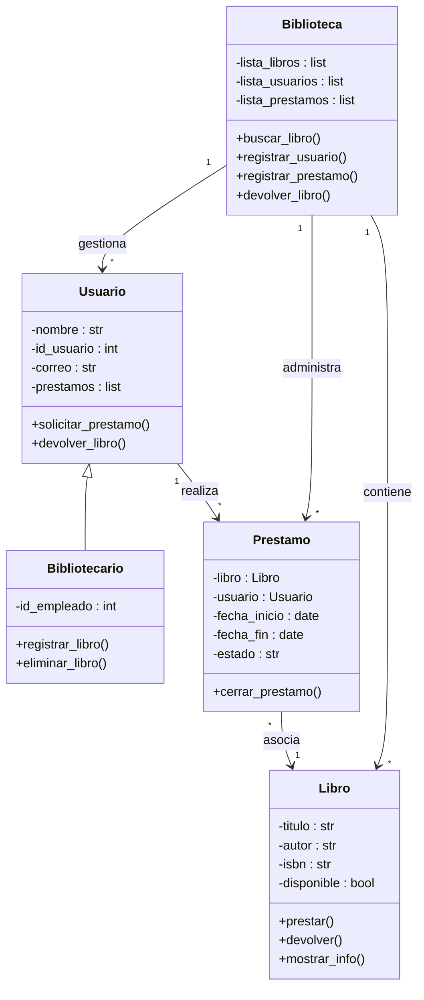

# reto-2

## Elija un problema de la vida real (sistema de gestión de biblioteca, negocio de compra-venta, automóvil, etc) que se pueda modelar a través de objetos y clases. Plantee las relaciones de clases, composiciones, propiedades y comportamientos del sistema en uno mas diagramas tipo UML.

# las flechas con punta vacía (<|--) indican herencia, por ejemplo Bibliotecario hereda de Usuario y adquiere sus atributos y métodos; los rombos rellenos (*--) representan composición, como en el caso de la Biblioteca, que está compuesta por Libro, Usuario y Prestamo, y si la biblioteca desaparece también lo hacen estos elementos; finalmente, las flechas (-->) muestran asociaciones, como que un Usuario realiza Prestamo y cada Prestamo está vinculado a un Libro.
